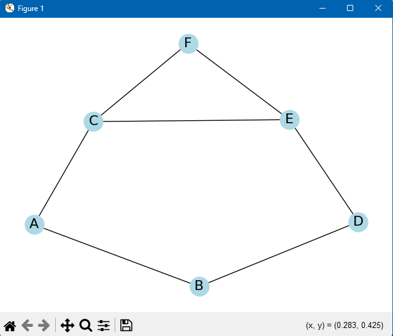
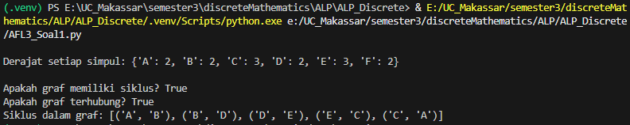
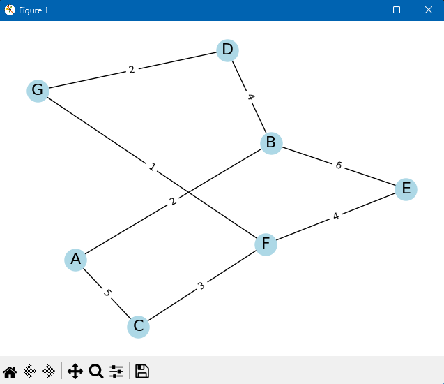
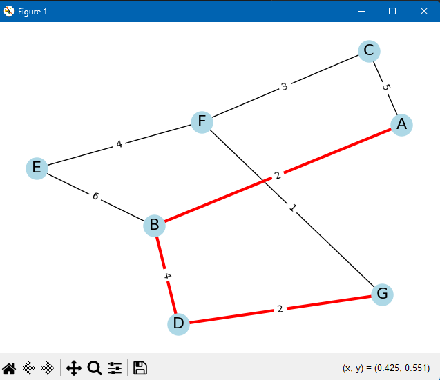
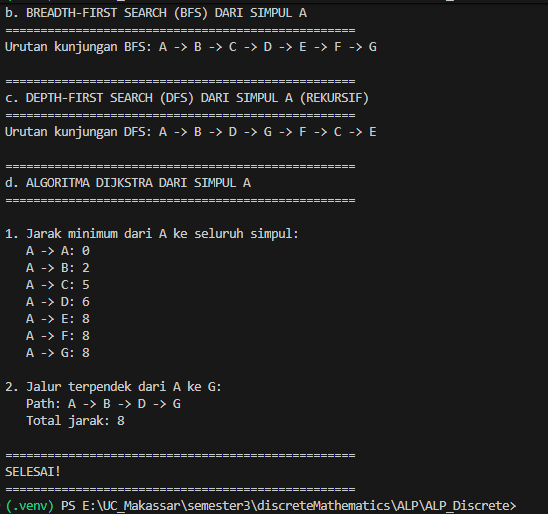

 # ALP Matemarika Diskrit - Teori Graf

## Overview
Projek ini merupakan bentuk implementasi teori graf dalam Python. Beberapa operasi dari teori tersebut telah diubah menjadi *methods* yang siapa digunakan untuk melakukan beberapa operasi dalam teori graf. Semua *method* ini digabung dalam sebuah class `Graf` yang pada dasarnya menggunakan library lain, yaitu *etworkX*, *matplotlib.pyplot*, dan *deque*.

## Class Methods

### `__init__`
Sebagai inisialisasi untuk sebuah variabel menjadi objek *networkX* agar bisa diproses sebagai graf.
```
graph = Graf()
```

### `add_node`
Digunakan untuk menambah sebuah *node*, atau titik, atau simpul dalam sebuah Graf. Semua simpul **harus dalam tipe data yang sama** agar berkeja. Menggunakan *method* bawaan dari *networkX*.
```
G = Graf()

# Nodes angka
G.add_node(1)
G.add_node(2)   
G.add_node(3)   


graph = Graf()

# Nodes huruf
graph.add_node('A')
graph.add_node('B')   
graph.add_node('C')
```

### `add_nodes_from`
Sama seperti *method* sebelumnya, tetapi jika mau menyimpan semua simpulnya dalam sebuah list terdahulu. *Method* ini akan menambah semua simpul dari list. Menggunakan *method* bawaan dari *networkX*.
```
graph = Graf()

# Vertices
vertices = ['A', 'B', 'C', 'D', 'E', 'F', 'G']
graph.add_nodes_from(vertices)
```

### `add_edge`
Untuk menambahkan sebuah hubungan antara dua simpul. Memiliki dua parameter, yaitu titik awal sampai titik tujuan. Bisa menambahkan bobot/jarak antar dua titik tersebut.
```
#.... Existing code....

graph.add_edge('A', 'B')
graph.add_edge('A', 'C')
graph.add_edge('B', 'D')

#.....

G.add_edge(1, 2, weight=4.5)
G.add_edge(1, 3, weight=3.2)
G.add_edge(2, 4, weight=2.7)
```

### `visualize_graph`
Menggambarkan graf yang sudah dibuat. Memakai beberapa *method* dari library *networkX* dan *Matplotlib*, lebih tepatnya `nx.draw()` dan `plot.show()`
```
G = Graf()
#.... Existing code....

G.visualize_graph()
```

### `shortest_path`
Digunakan untuk menentukan path terpendek dari satu titik ke titik tujuan yang ditentukan di parameter yang ditentukan
```
G.shortest_path(1, 5)
```

### `shortest_distance`
Digunakan untuk menentukan jarak path terpendek dari satu titik ke titik tujuan yang ditentukan di parameter yang ditentukan. Jarak ditentukan dengan menentukan path terpendek, lalu menjumlahkan bobot dari setiap *edge* atau garis
```
G.shortest_distance(1, 5)
```

### `visualize_shortest_path`
Sama seperti *method* visualize_graph() dengan tambahan penanda jalur mana yang paling terpendek dari titik awal ke titik tujuan.
```
G.visualize_shortest_path(1, 5)
```

### `get_degrees`
Untuk mengambil setiap dejarat dari setiap titik ada di dalam graf.
```
degrees = graph.get_degrees()
print(f"\nDerajat setiap simpul: {degrees}")
```

### `has_cycle`
Untuk menentukan jika graf memiliki putaran/*loop* atau tidak. Akan mengreturn nilai Boolean (True/False).
```
print(f"\nApakah graf memiliki siklus? {graph.has_cycle()}")

```

### `is_connected`
Untuk menentukan jika setiap titik pada graf saling terhubung atau tidak. Akan mengreturn nilai Boolean (True/False).
```
print(f"Apakah graf terhubung? {graph.is_connected()}")
```

### `get_cycle_info`
Untuk menentukan satu jalur yang merupakan putaran/*loop* di dalam sebuah graf. Menggunakan method *.find_cycle* dari library networkX.
```
cycle = graph.get_cycle_info()
print(f"Siklus dalam graf: {cycle if cycle else 'Tidak ada siklus'}")
```

### `bfs`
Untuk melakukan perjalanan di setiap simpul dalam graf secara melebar. Menggunakan library *deque* untuk menyimpan antrian simpul yang mau dikunjungi. Parameter yang dibutuhkan yaitu titik mulai perjalanan.
```
bfs_result = graph.bfs('A')
print(f"Urutan kunjungan BFS: {' -> '.join(bfs_result)}")
```

### `dfs`
Untuk melakukan perjalanan di setiap simpul dalam graf secara mendalam. Menggunakan struktur data tumpukan (stack) atau dilakukan secara rekursif.
```
dfs_result = graph.dfs('A')
print(f"Urutan kunjungan DFS: {' -> '.join(dfs_result)}")

```

### `dijkstra_distances`
Metode untuk mencari jalur terpendek (shortest path) dari satu titik awal ke semua titik lain dalam sebuah graf berbobot (weighted graph). Langsung menggunakan method *nx.single_source_dijkstra_path_length* dari library networkX
```
distances = graph.dijkstra_distances('A')
print("\n1. Jarak minimum dari A ke seluruh simpul:")
for vertex in sorted(distances.keys()):
    print(f"   A -> {vertex}: {distances[vertex]}")
```

## Installation
Jalankan command ini di terminal jika belum mempunyai library networkX, Matplotlib, atau keduanya.
```
pip install networkx
pip install matplotlib
```

## Hasil Penyelesaian AFL-3






## Anggota Kelompok
1. Andi Tubagus Faatih Keane (0806022410015)
2. Britney Glory Chen (0806022410020)
3. Exsel Octavia Gosal (0806022410003)
4. Keihan Pradika Muzaki (0806022410011)
